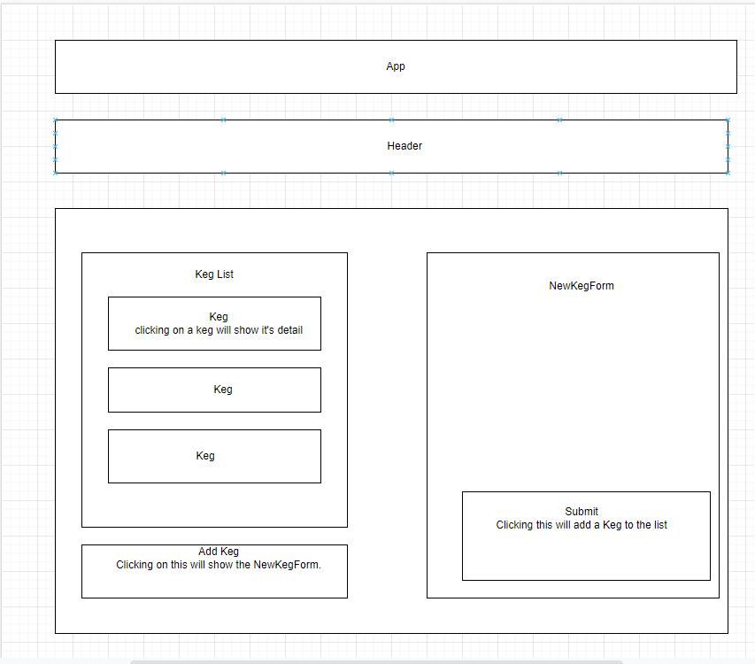

#  Keg List

#### Application will allow you to add kegs and keep track of how many pints are left

#### By Will Pratt

## Technologies Used

* React
* NPM

## Description

This application will let you add any number of kegs with information about them and then allow you to sell them to watch the amount of drinks go down

## Component Diagram 

## Setup/Installation Requirements

* Navigate to Repository and clone repo
* open in VSC with gitbash
* In VSC terminal run npm install
* In VSC terminal run npm run start

## Known Bugs

* *No known bugs at this time*
## License

[MIT](https://opensource.org/licenses/MIT)

Copyright (c) _4/15/2022_ _William Pratt_